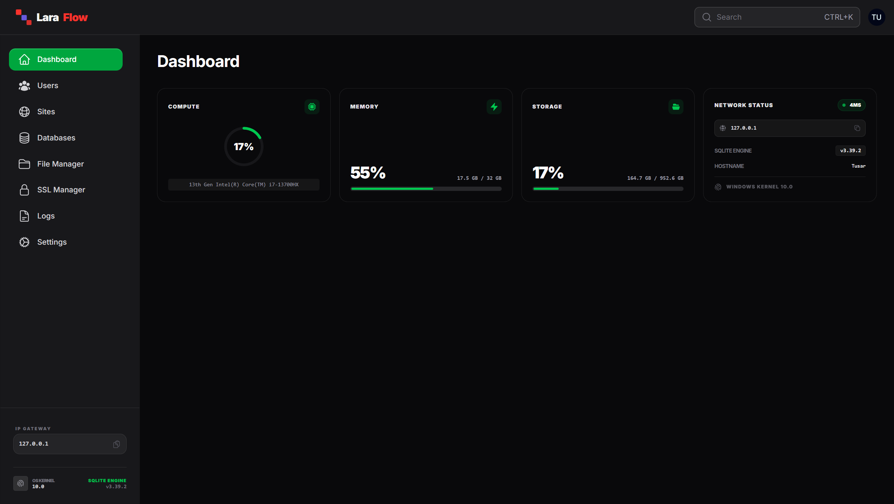

# Lara Flow

<p align="center">
  <span style="display:inline-flex; align-items:center; gap:10px;">
    <svg xmlns="http://www.w3.org/2000/svg" width="32" height="32" viewBox="0 0 42 42">
      <rect x="4" y="4" width="12" height="12" rx="2" fill="#F9322C"></rect>
      <rect x="16" y="16" width="12" height="12" rx="2" fill="#6C5CE7"></rect>
      <rect x="28" y="28" width="12" height="12" rx="2" fill="#F9322C"></rect>
    </svg>
    <strong style="font-size:20px; font-weight:900;">
      <span style="color:#e5e7eb;">Lara</span>
      <span style="color:#F9322C;">Flow</span>
    </strong>
  </span>
</p>


<p align="center">
  <strong>A self-hosted hosting panel for Laravel and PHP applications.</strong>
</p>

<p align="center">
  <a href="#"></a>
  <a href="#"></a>
  <a href="#"></a>
  <a href="#"></a>
  <a href="#"></a>
</p>

---

## Overview

**Lara Flow** is a modern, self-hosted hosting control panel built with **Laravel**, designed specifically for hosting and managing **Laravel and PHP applications**.

It focuses on providing a clean developer experience, deep Laravel integration, and full control over your infrastructure without relying on third-party SaaS platforms.

---

## Branding

<table align="center" cellpadding="10">
  <tr>
    <!-- Dark Mode Logo -->
    <td align="center">
      <p><strong>Dark Mode</strong></p>
      <span style="display:inline-flex; align-items:center; gap:10px;">
        <svg xmlns="http://www.w3.org/2000/svg" width="32" height="32" viewBox="0 0 42 42">
          <rect x="4" y="4" width="12" height="12" rx="2" fill="#F9322C"></rect>
          <rect x="16" y="16" width="12" height="12" rx="2" fill="#6C5CE7"></rect>
          <rect x="28" y="28" width="12" height="12" rx="2" fill="#F9322C"></rect>
        </svg>
        <strong style="font-size:20px; font-weight:900;">
          <span style="color:#e5e7eb;">Lara</span>
          <span style="color:#F9322C;">Flow</span>
        </strong>
      </span>
    </td>
    <td align="center">
      <p><strong>Light Mode</strong></p>
      <span style="display:inline-flex; align-items:center; gap:10px;">
        <svg xmlns="http://www.w3.org/2000/svg" width="32" height="32" viewBox="0 0 42 42">
          <rect x="4" y="4" width="12" height="12" rx="2" fill="#F9322C"></rect>
          <rect x="16" y="16" width="12" height="12" rx="2" fill="#6C5CE7"></rect>
          <rect x="28" y="28" width="12" height="12" rx="2" fill="#F9322C"></rect>
        </svg>
        <strong style="font-size:20px; font-weight:900;">
          <span style="color:#333;">Lara</span>
          <span style="color:#F9322C;">Flow</span>
        </strong>
      </span>
    </td>
  </tr>
</table>


The Lara Flow logo is Blade-templated and optimized for both light and dark interfaces, ensuring consistent branding across dashboards and user interfaces.

---

## Dashboard Preview

<p align="center">
  
</p>

> Interface previews are illustrative. Features and layouts may evolve during development.

---

## Technology Stack

Lara Flow is built entirely on the Laravel ecosystem:

- Laravel (core framework)
- Filament (administration and panel UI)
- Livewire (reactive components)
- Blade (server-rendered views)
- Tailwind CSS (styling)
- Laravel Queues
- Supervisor (process management)
- Laravel Reverb (real-time services)

---

## Features and Capabilities

### Application Hosting
- Host Laravel applications
- Host standard PHP applications
- Multiple applications per server
- Environment variable management

### Queue Management
- Manage Laravel queue workers
- Restart and monitor background jobs
- Supervisor integration

### Reverb Management
- Manage Laravel Reverb services
- Control WebSocket processes
- Support for real-time application features

### Server Utilities
- PHP version management
- Storage and permission handling
- Log viewing and diagnostics

### Security
- Secure server-side execution
- Signed URLs and token-based actions
- Planned role-based access control

---

## Project Status

Lara Flow is currently **under active development**.

The current focus is on building a stable foundation for:
- Laravel application hosting
- PHP application hosting
- Queue and process management
- Real-time service control

Additional functionality may be introduced as the project matures.

---

## Roadmap

### Phase 1 (Current)
- Core Laravel and Filament setup (✅)
- Authentication and authorization (✅)
- Application creation and management
- Queue worker control
- Reverb service management

### Phase 2
- Domain and SSL management
- Backup and restore system
- Log explorer and monitoring
- PHP site enhancements

### Phase 3
- Plugin and extension system
- Multi-server support
- Team access and permissions
- Performance metrics and analytics

---

## Installation

Installation instructions will be provided once the first stable release is available.

Planned installation flow:
```bash
git clone https://github.com/yourusername/lara-flow.git
cd lara-flow
composer install
php artisan migrate
php artisan serve
